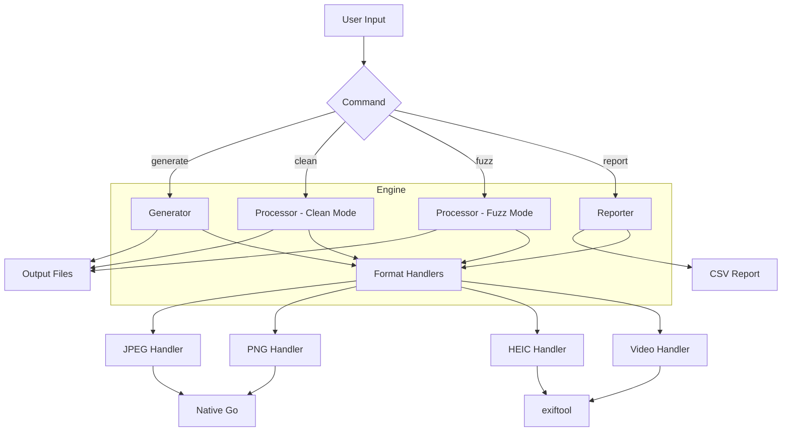
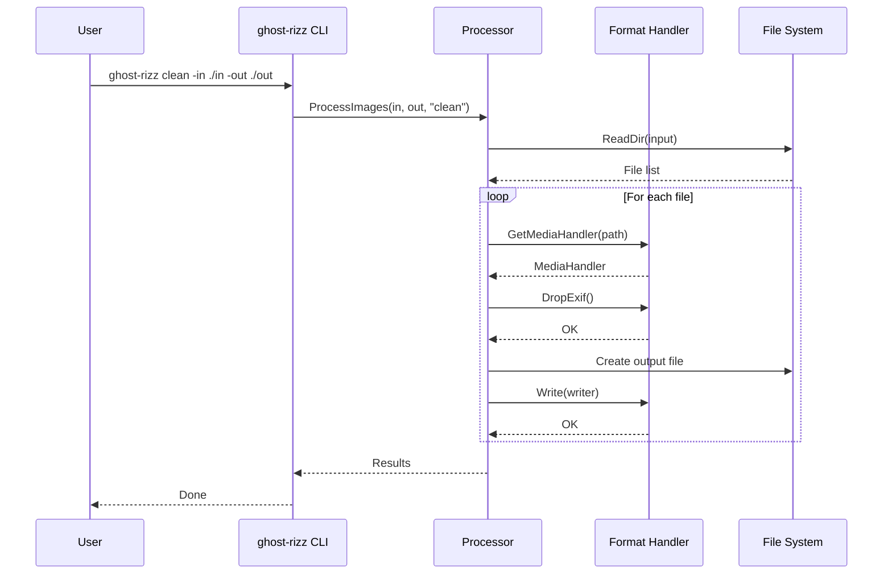
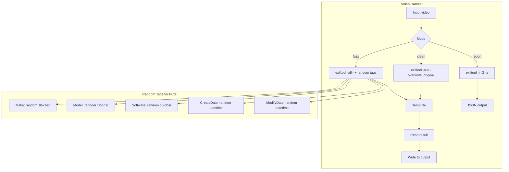

# ghost-rizz

**Concurrent EXIF metadata cleaner and fuzzer, written in pure Go.**
Strip, fuzz or audit the metadata of thousands of images per second.

```
$ ghost-rizz report -in ./photos
   1204 files scanned in 0.31s → report.csv

$ ghost-rizz clean -in ./photos -out ./clean
   1204 files stripped in 0.22s
```

<sub>Companion product: **[Lethe](https://thothandson.github.io/lethe)** — same
engine, wrapped in a desktop app with presets, watch folders and paid
support. `ghost-rizz` is and will remain free.</sub>

---

## Why this exists

Modern images carry a metadata shadow: device, GPS, software, timestamps,
owner. Useful for editors and archives; leaky for people publishing photos
in public. `ghost-rizz` gives you three operations, at scale:

- **`clean`** — strip the EXIF segment entirely.
- **`fuzz`** — keep the structure, randomize the values (Make, Model,
  Software, DateTime, GPS, ExposureTime). Useful for testing metadata
  ingestion pipelines or breaking naive fingerprinting.
- **`report`** — extract every tag to CSV for audit.

Single static binary. Zero runtime dependencies (except `exiftool` for
HEIC and video formats — see below).

## How it works

### High-level architecture



### Command flow

```mermaid
flowchart LR
    subgraph Generate
        G1[ghost-rizz generate] --> G2[Create dummy images]
        G2 --> G3[Inject EXIF via exifutil]
        G3 --> G4[Write JPEG/PNG]
    end
    
    subgraph Clean
        CL1[ghost-rizz clean] --> CL2[Scan input dir]
        CL2 --> CL3[Filter supported formats]
        CL3 --> CL4[Worker pool]
        CL4 --> CL5[Format handler]
        CL5 --> CL6[DropExif]
        CL6 --> CL7[Write output]
    end
    
    subgraph Fuzz
        FZ1[ghost-rizz fuzz] --> FZ2[Scan input dir]
        FZ2 --> FZ3[Filter supported formats]
        FZ3 --> FZ4[Worker pool]
        FZ4 --> FZ5[Format handler]
        FZ5 --> FZ6[SetExif random]
        FZ6 --> FZ7[Write output]
    end
    
    subgraph Report
        RP1[ghost-rizz report] --> RP2[Scan input dir]
        RP2 --> RP3[Filter supported formats]
        RP3 --> RP4[Worker pool]
        RP4 --> RP5[Format handler]
        RP5 --> RP6[RawExif]
        RP6 --> RP7[Parse EXIF tags]
        RP7 --> RP8[CSV output]
    end
```



### Internal processing pipeline



### Video format processing (delegates to exiftool)



## Install

**macOS (Homebrew)**
```
brew install ThothandSon/tap/ghost-rizz
```

**Windows (Scoop)**
```
scoop bucket add thothandson https://github.com/ThothandSon/scoop-bucket
scoop install ghost-rizz
```

**Linux / other**

Download the pre-built binary for your architecture from the
[latest release](https://github.com/ThothandSon/ghost-rizz/releases/latest)
and put it on your `PATH`.

**From source** (requires Go 1.22+)
```
git clone https://github.com/ThothandSon/ghost-rizz
cd ghost-rizz
go build -o ghost-rizz ./cmd/ghost-rizz
```

## Quick start

```
# 1. Generate 100 test images with EXIF injected
ghost-rizz generate -count 100 -out ./demo

# 2. Audit what they contain
ghost-rizz report -in ./demo   # writes demo/report.csv

# 3. Strip metadata
ghost-rizz clean -in ./demo -out ./clean

# 4. Process videos (MP4, MOV, MKV, etc.)
ghost-rizz report -in ./videos
ghost-rizz clean -in ./videos -out ./clean_videos
ghost-rizz fuzz -in ./videos -out ./fuzz_videos -mode fuzz
```

## Commands

### `generate` — procedural test images

Creates unique-colored JPEGs with realistic EXIF injected (Make, Model,
Software, GPS, ExposureTime, DateTime). Meant for testing your pipeline.

```
ghost-rizz generate -count 1000 -out ./input_photos
```

### `clean` / `fuzz` — modify metadata

```
ghost-rizz clean -in ./input -out ./output    # strip EXIF entirely
ghost-rizz fuzz  -in ./input -out ./output    # randomize EXIF values
```

Output files are suffixed automatically: `photo_clean.jpg`, `photo_fuzz.jpg`.
The original folder is never touched.

> **Historical note:** in versions ≤ v0.9 both operations were under the
> `fuzz` subcommand with `-mode`. From v1.0 they're independent verbs. The
> old form still works.

### `report` — audit CSV

```
ghost-rizz report -in ./photos               # writes photos/report.csv
ghost-rizz report -in ./photos -out ./out    # writes out/report.csv
```

Always run `report` before `clean` or `fuzz`. It's non-destructive and
tells you exactly what you're about to delete.

## Supported formats

| Format | Support | Notes |
|---|---|---|
| **JPEG** (`.jpg`, `.jpeg`) | Native, fast | Full read/write |
| **PNG** (`.png`) | Native, fast | Reads `tEXt`/`iTXt` chunks |
| **HEIC / HEIF** (`.heic`, `.heif`) | Delegates to `exiftool` | Requires `exiftool` installed. HEIC `fuzz` currently only randomizes Make, Model, Software. |
| **MP4** (`.mp4`) | Delegates to `exiftool` | Requires `exiftool` installed. Full clean/fuzz/report support. |
| **MOV** (`.mov`) | Delegates to `exiftool` | Requires `exiftool` installed. Full clean/fuzz/report support. |
| **MKV** (`.mkv`) | Delegates to `exiftool` | Requires `exiftool` installed. Full clean/fuzz/report support. |
| **AVI** (`.avi`) | Delegates to `exiftool` | Requires `exiftool` installed. Full clean/fuzz/report support. |
| **WebM** (`.webm`) | Delegates to `exiftool` | Requires `exiftool` installed. Full clean/fuzz/report support. |
| **M4V** (`.m4v`) | Delegates to `exiftool` | Requires `exiftool` installed. Full clean/fuzz/report support. |
| **3GP** (`.3gp`) | Delegates to `exiftool` | Requires `exiftool` installed. Full clean/fuzz/report support. |

## Benchmark

1 000 JPEGs on a standard machine (Apple M2, NVMe, macOS 15):

| Operation | Time |
|---|---|
| `generate` (create with EXIF) | ~3.02 s |
| `clean` (strip 1 000 files) | **~0.19 s** |
| `fuzz` (randomize 1 000 files) | ~0.66 s |
| `report` (CSV of 1 000 files) | ~0.88 s |

Scaling is linear via `sync.WaitGroup`; hundreds of thousands of images
finish in seconds. The bottleneck is disk I/O, not CPU. Run
`./run_benchmark.sh` on your own hardware to reproduce.

## Threat model in one paragraph

`ghost-rizz` protects the metadata that is visible to a program reading
the file with a standard EXIF/XMP/IPTC parser. It **does not** hide
information encoded in the pixels (steganography), **does not** touch
embedded JPEG thumbnails smaller than the main image (some tools use them
to leak the pre-crop), **does not** guarantee anonymity against traffic
analysis or platform-side profiling, and **is not** a substitute for
end-to-end encryption. Read [`SECURITY.md`](./SECURITY.md) for the full
model and known limitations.

## Testing

```
go test ./...
go test ./... -coverprofile=cov.out && go tool cover -func=cov.out
```

Coverage is enforced at 85% by CI. Contributions welcome — see the
[issues](https://github.com/ThothandSon/ghost-rizz/issues) tab.

## When `ghost-rizz` is not enough

- **You need a GUI, watch folders, or presets by persona** — try
  [Lethe](https://thothandson.github.io/lethe), a paid desktop app built
  on top of this same engine. Same author (Thoth & Son).
- **You need PDF, DOCX, RAW or exotic formats** —
  [`exiftool`](https://exiftool.org) by Phil Harvey has 20 years of
  coverage `ghost-rizz` will never match. Use `exiftool` for those cases;
  use `ghost-rizz` for the JPEG/PNG/HEIC/Video hot path.
- **You want an ebook on how to use these tools well** — see
  *Rastro Zero* (PT-BR) at thothandson.github.io/lethe.

## License

MIT © 2026 Thoth & Son. See [`LICENSE`](./LICENSE).
